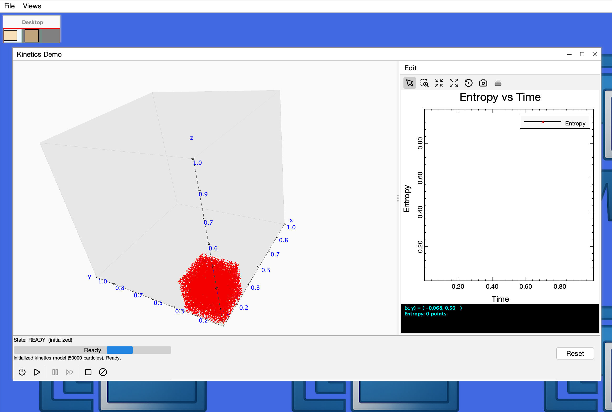

# mdi-3D – 3D Support for the MDI Framework


`mdi-3D` is an optional 3D extension module for the MDI scientific desktop framework.

It adds hardware-accelerated 3D rendering support using JOGL while preserving the lightweight nature of the core `mdi` project.

---

## Why Separate 3D?

Most scientific desktop applications do not require 3D rendering.

Separating 3D into its own Maven module:

- Keeps the core `mdi` dependency lightweight  
- Avoids pulling in JOGL unless explicitly needed  
- Reduces compatibility risk with future Java releases  
- Allows 2D-only applications to remain stable and minimal  

This design ensures that adding 3D is a conscious architectural choice.

---

## Installation

First include the core `mdi` dependency:

```xml
<dependency>
    <groupId>io.github.heddle</groupId>
    <artifactId>mdi</artifactId>
    <version>1.0.0</version>
</dependency>


## Demo Application

The repository includes a full-featured `DemoApp3D` showcasing:

- Interactive 3D globe with poltical boundaries
- a 3D simulation of the free expansion of a gas

To run the demo from the project source:

```bash
mvn clean package
mvn exec:java -Dexec.mainClass="edu.cnu.mdi.mdi3D.app.DemoApp3D"
```
Here are two pictures of the Kinetics simulation in DemoApp3D. The first is at the start of the simulation when
50,000 particles are placed in the corner of a box. The second is at the end of the simulation where the
paricles have spread throughout the box. The plot shows the increase in entropy over time.


